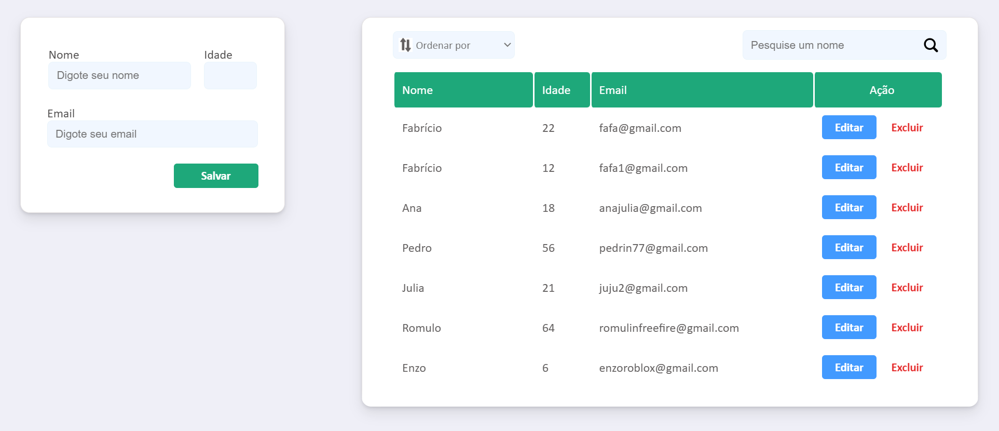

<h1 align="center">SPGE - Sistema Padrão Gerenciador de Escolas</h1>

 

<h2>Sobre o projeto 🔎</h2>
O SPGE é um sistema Web que possui o objetivo de facilitar a vida dos estudantes e funcionários das escolas. Com seu fácil manuseio e responsividade, o SPGE torna mais simples o acesso e a manipulação de informações escolares.
  

<h2>Tecnologias utilizadas 💻</h2>
* Java (Spring Boot/Spring Data) 
* Javascript + JQuery 
* HTML + CSS 
* Banco de dados MySQL
  

<h2>Recursos do site </h2>
* Visualização e emissão de pdf das notas; 
* Vizualização dos dados pessoais/escolares; 
* Vizualização dos dias e conteúdos de futuras provas; 
* Vizualização dos produtos vendidos na escola; 
* Vizualização dos recados emitidos pela escola; 
* Vizualização de conteúdos e links adcionais (complementares âs aulas).  
 

<h2>Passo a passo para rodar em seu PC</h2>
* Possua uma JDK 17 ou superior instalada em seu PC; 
* Baixe ou clone o projeto em seu PC; 
* Configure algum banco de dados MySQL, seja ele local ou de algum serviço externo (recomendo os do site RailWay) dentro do applications.properties. Para isso você precisa do 
host, nome, porta, usuario e senha do banco de dados; 
* Dê build ou compile no projeto usando alguma IDE (recomendo Intelij), para baixar todas as dependências; 
* Por fim, dê start na classe principal do projeto (FutshopApplication) e pronto, ele já funcionará.
  

<h2>Link video 📺</h2>
https://youtu.be/6pFGh1nESVI
  

<h2>Link site :zap:</h2>
Desclupe, o site ainda não está no ar
  

<h2>Autor :raising_hand:</h2>

| [ Fabrício Ferreira Tavares](https://github.com/fabricionft) | 
| :---: | 
