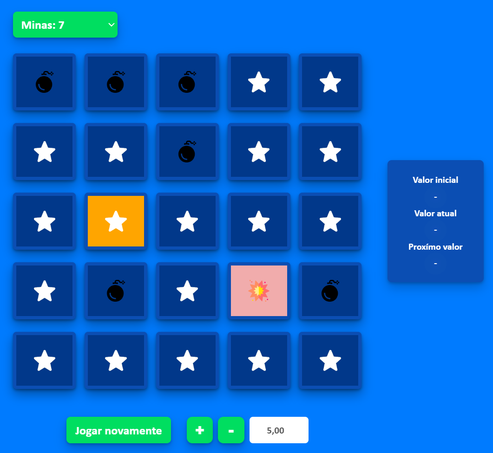

# Réplica Mines

<h2>Sobre o projeto</h2>
O projeto consiste em um pequeno e demonstrativo site de apostas que possui uma “réplica” do famoso jogo de cassino Mines, muito comum em sites como Bet365 ou Betano. Diferente dos meus projetos anteriores, este já é bem mais elaborado, possuindo mais camadas no back-end e conceitos de segurança e performance, como: DTO,s, criptografia, limitação de rotas de usuários e admin’s, autenticação através de tokens JWT, tratamento de erros, entre outros.
  
Obs: a intenção do mesmo não é ser 100% igual ao jogo original, mas sim ter uma jogabilidade e mecânica parecida.
  

<h2>Tecnologias utilizadas 💻</h2>
* Java (Spring Boot/Spring Security/Spring Data) 
* Javascript + JQuery 
* HTML + CSS 
* Banco de dados MySQL
  

<h2>Como jogar o Mines 📎:</h2>
* Crie e acesse uma conta; 
* Deposite algum valor, ou jogue com seus 100 reais iniciais (toda nova conat recebe 100 reais); 
* Vá na tela inicial e selecione para apostar, a aposta miníma é 1 real, e a máxima o seu saldo. A dinâmica do jogo funciona da seguinte forma: primeiramente a pessoa escolhe uma certa quantidade de bombas (obs: quanto mais bombas, maior é o lucro e a chance de errar), e depois precisa escolher os quadrados onde elas não aparecem. A cada acerto o valor atual é multiplicado por um percentual relativo à quantidade de bombas da rodada. Ao errar o jogador perde o valor apostado. 
  
ATENÇÂO: Todo os valores apostados/depositados/sacados neste site são meramente representativos. Caso você que está lendo algum dia vá apostar em um site de verdade, tenha consciência.
  

<h2>Recursos so site 🎯</h2>
* Criação de contas, com criptografia de senhas; 
* Login de contas; 
* Depósitos e saques de valores ficctícios; 
* Jogo Mines; 

* Histórico de apostas.
  

<h2>Passo a passo para rodar em seu PC</h2>
* Possua uma JDK 17 ou superior instalada em seu PC; 
* Baixe ou clone o projeto em seu PC; 
* Configure algum banco de dados MySQL, seja ele local ou de algum serviço externo (recomendo os do site RailWay) dentro do applications.properties. Para isso você precisa do 
host, nome, porta, usuario e senha do banco de dados; 
* Dê build ou compile no projeto usando alguma IDE (recomendo Intelij), para baixar todas as dependências; 
* Por fim, dê start na classe principal do projeto (FutshopApplication) e pronto, ele já funcionará.
  

<h2>Link video 📺</h2>
https://youtu.be/xGM5xiRV5Zs

<h2>Link site :zap:</h2>
Desupe, o site ainda não está no ar
  

<h2>Autor :raising_hand:</h2>

| [ Fabrício Ferreira Tavares](https://github.com/fabricionft) | 
| :---: | 
